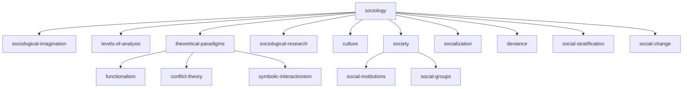

# Seed Concept List

This is the Phase 1 content backlog: the ~50 most central and foundational concepts in introductory sociology, selected from the table of contents of OpenStax *Introduction to Sociology 3e* (CC BY 4.0). No lesson content lives here — only concept names, tree positions, and dependency arrows.

Each row maps directly to the concept-node schema (`docs/schema.md`):

- **Slug** — the future filename in `/content` (e.g., `social-norms.md`) and the node's unique ID.
- **Module** — the Mode 1 (linear course) grouping, matching OpenStax chapter structure.
- **Parent** — exactly one broader concept, driving the Mode 2 hierarchy tree. The single root is `sociology` (parent: `null`).
- **Prerequisites** — concepts a learner should complete first. These are the dependency arrows. The parent is often, but not always, a prerequisite.

## Selection principles

1. **Centrality first.** The foundational chapters (introduction, theory, research, culture, society, socialization, groups, deviance, stratification) are covered densely. Topical institution chapters get one hub node each. Entire chapters are deferred (see the end of this document).
2. **One tree, one root.** Every concept has exactly one parent so Mode 2 renders as a clean collapsible tree. Cross-cutting relationships belong in `prerequisites` and, later, the `related` frontmatter field — not in the tree.
3. **Hub nodes are real lessons.** Nodes like `culture` or `deviance` are not empty folders; each will be a genuine overview lesson that orients the learner before they descend into children.
4. **Auditability.** Every concept traces to an OpenStax chapter, which keeps attribution (`adapted_from:`) and the `subfield/` tag taxonomy consistent.

## Hierarchy overview (Mode 2 top levels)

The full tree is derivable from the `Parent` column below.

## Module 1 — An Introduction to Sociology (OpenStax Ch. 1)

| # | Slug | Title | Parent | Prerequisites |
|---|---|---|---|---|
| 1 | `sociology` | What Is Sociology? | `null` (root) | — |
| 2 | `sociological-imagination` | The Sociological Imagination | `sociology` | `sociology` |
| 3 | `levels-of-analysis` | Micro, Meso, and Macro Levels of Analysis | `sociology` | `sociology` |
| 4 | `theoretical-paradigms` | Theoretical Paradigms in Sociology | `sociology` | `sociological-imagination` |
| 5 | `functionalism` | Structural Functionalism | `theoretical-paradigms` | `theoretical-paradigms` |
| 6 | `conflict-theory` | Conflict Theory | `theoretical-paradigms` | `theoretical-paradigms` |
| 7 | `symbolic-interactionism` | Symbolic Interactionism | `theoretical-paradigms` | `theoretical-paradigms`, `levels-of-analysis` |

## Module 2 — Sociological Research (OpenStax Ch. 2)

| # | Slug | Title | Parent | Prerequisites |
|---|---|---|---|---|
| 8 | `sociological-research` | How Sociologists Study Society | `sociology` | `sociology` |
| 9 | `scientific-method` | The Scientific Method in Sociology | `sociological-research` | `sociological-research` |
| 10 | `quantitative-and-qualitative-methods` | Quantitative and Qualitative Approaches | `sociological-research` | `scientific-method` |
| 11 | `surveys` | Surveys | `quantitative-and-qualitative-methods` | `quantitative-and-qualitative-methods` |
| 12 | `ethnography` | Ethnography and Field Research | `quantitative-and-qualitative-methods` | `quantitative-and-qualitative-methods` |
| 13 | `research-ethics` | Research Ethics | `sociological-research` | `sociological-research` |

## Module 3 — Culture (OpenStax Ch. 3)

| # | Slug | Title | Parent | Prerequisites |
|---|---|---|---|---|
| 14 | `culture` | What Is Culture? | `sociology` | `sociological-imagination` |
| 15 | `values-and-beliefs` | Values and Beliefs | `culture` | `culture` |
| 16 | `social-norms` | Social Norms | `culture` | `culture`, `values-and-beliefs` |
| 17 | `symbols-and-language` | Symbols and Language | `culture` | `culture` |
| 18 | `subcultures-and-countercultures` | Subcultures and Countercultures | `culture` | `culture`, `social-norms` |
| 19 | `ethnocentrism-and-cultural-relativism` | Ethnocentrism and Cultural Relativism | `culture` | `culture`, `values-and-beliefs` |

## Module 4 — Society and Social Interaction (OpenStax Ch. 4)

| # | Slug | Title | Parent | Prerequisites |
|---|---|---|---|---|
| 20 | `society` | Society and Social Structure | `sociology` | `culture` |
| 21 | `types-of-societies` | Types of Societies | `society` | `society` |
| 22 | `social-institutions` | Social Institutions | `society` | `society` |
| 23 | `status` | Status: Ascribed and Achieved | `society` | `society` |
| 24 | `roles` | Roles, Role Conflict, and Role Strain | `society` | `status` |
| 25 | `social-construction-of-reality` | The Social Construction of Reality | `society` | `symbolic-interactionism`, `roles` |

## Module 5 — Socialization (OpenStax Ch. 5)

| # | Slug | Title | Parent | Prerequisites |
|---|---|---|---|---|
| 26 | `socialization` | Socialization | `sociology` | `culture`, `society` |
| 27 | `development-of-the-self` | Development of the Self | `socialization` | `socialization`, `symbolic-interactionism` |
| 28 | `agents-of-socialization` | Agents of Socialization | `socialization` | `socialization`, `social-institutions` |
| 29 | `resocialization` | Resocialization and Total Institutions | `socialization` | `socialization` |

## Module 6 — Groups and Organizations (OpenStax Ch. 6)

| # | Slug | Title | Parent | Prerequisites |
|---|---|---|---|---|
| 30 | `social-groups` | Social Groups | `society` | `society`, `status` |
| 31 | `primary-and-secondary-groups` | Primary and Secondary Groups | `social-groups` | `social-groups` |
| 32 | `in-groups-and-out-groups` | In-Groups, Out-Groups, and Reference Groups | `social-groups` | `social-groups` |
| 33 | `bureaucracy` | Formal Organizations and Bureaucracy | `social-groups` | `social-groups`, `social-institutions` |

## Module 7 — Deviance, Crime, and Social Control (OpenStax Ch. 7)

| # | Slug | Title | Parent | Prerequisites |
|---|---|---|---|---|
| 34 | `deviance` | Deviance | `sociology` | `social-norms` |
| 35 | `social-control` | Social Control | `deviance` | `deviance` |
| 36 | `labeling-theory` | Labeling Theory | `deviance` | `deviance`, `symbolic-interactionism` |
| 37 | `strain-theory` | Strain Theory | `deviance` | `deviance`, `functionalism` |

## Module 8 — Social Stratification (OpenStax Ch. 9–10)

| # | Slug | Title | Parent | Prerequisites |
|---|---|---|---|---|
| 38 | `social-stratification` | Social Stratification | `sociology` | `society`, `conflict-theory` |
| 39 | `social-class` | Social Class | `social-stratification` | `social-stratification` |
| 40 | `social-mobility` | Social Mobility | `social-stratification` | `social-class` |
| 41 | `global-stratification` | Global Stratification | `social-stratification` | `social-stratification` |

## Module 9 — Race, Ethnicity, and Gender (OpenStax Ch. 11–12)

| # | Slug | Title | Parent | Prerequisites |
|---|---|---|---|---|
| 42 | `race-and-ethnicity` | Race and Ethnicity | `social-stratification` | `social-stratification`, `social-construction-of-reality` |
| 43 | `prejudice-and-discrimination` | Prejudice and Discrimination | `race-and-ethnicity` | `race-and-ethnicity`, `in-groups-and-out-groups` |
| 44 | `sex-and-gender` | Sex and Gender | `social-stratification` | `social-stratification`, `social-construction-of-reality` |
| 45 | `gender-socialization` | Gender Roles and Gender Socialization | `sex-and-gender` | `sex-and-gender`, `socialization` |
| 46 | `intersectionality` | Intersectionality | `social-stratification` | `race-and-ethnicity`, `sex-and-gender`, `social-class` |

## Module 10 — Social Institutions (OpenStax Ch. 14–18)

One hub node per institution for now; each can grow children in Phase 1+.

| # | Slug | Title | Parent | Prerequisites |
|---|---|---|---|---|
| 47 | `family` | Family | `social-institutions` | `social-institutions`, `socialization` |
| 48 | `religion` | Religion | `social-institutions` | `social-institutions` |
| 49 | `education` | Education | `social-institutions` | `social-institutions`, `socialization` |
| 50 | `power-and-authority` | Power and Authority | `social-institutions` | `social-institutions`, `conflict-theory` |
| 51 | `economic-systems` | Work and Economic Systems | `social-institutions` | `social-institutions`, `social-class` |

## Module 11 — Social Change (OpenStax Ch. 21)

| # | Slug | Title | Parent | Prerequisites |
|---|---|---|---|---|
| 52 | `social-change` | Social Change | `sociology` | `society`, `theoretical-paradigms` |
| 53 | `social-movements` | Social Movements | `social-change` | `social-change`, `in-groups-and-out-groups` |

## Deliberately deferred (Phase 1+ expansion candidates)

These OpenStax chapters are excluded from the seed set to keep the graph dense around foundations rather than broad and shallow:

- Ch. 8 — Media and Technology
- Ch. 13 — Aging and the Elderly
- Ch. 19 — Health and Medicine
- Ch. 20 — Population, Urbanization, and the Environment
- Deeper children under each institution hub (e.g., hidden curriculum, secularization, marriage patterns, political systems)
- All of Mode 4 (sociologist network) scaffolding — the `theorists` frontmatter field will accumulate this data passively as nodes are written

## Statistics

- **53 seed concepts** (within the 40–60 target)
- **10 direct children of the root** — a manageable first level for the Mode 2 tree
- **Maximum tree depth: 4** (`sociology` → `sociological-research` → `quantitative-and-qualitative-methods` → `surveys`)
- Every concept traces to an OpenStax *Introduction to Sociology 3e* chapter

## Status

- [ ] Reviewed against `docs/schema.md` field definitions
- [ ] Reviewed against `docs/taxonomy.md` subfield values
- [ ] Sample nodes written to stress-test (Stage 0, Step 6)
